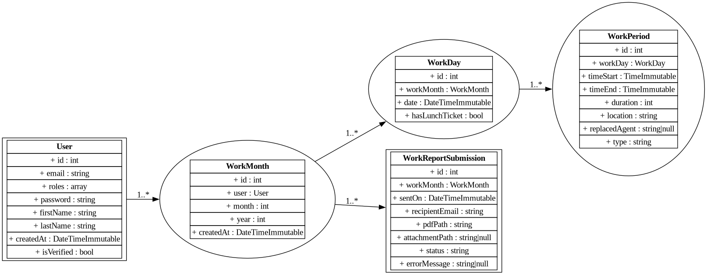

# Time Board

**Time Board** est une application web de gestion des feuilles de temps développée en Symfony 7.2.  
Elle simplifie la saisie, la génération et la transmission des fiches d’heures mensuelles.

---

## Fonctionnalités

- Saisie et édition des journées de travail
- Organisation des feuilles de temps par mois et année
- Calcul automatique des heures totales mensuelles
- Génération de rapports au format Excel et PDF à partir de templates
- Transmission des fiches par email
- Gestion des versions (limitation du nombre de modifications)
- Interface responsive optimisée (Bootstrap 5, Stimulus, Turbo)

---

## Technologies utilisées

- PHP 8.2+
- Symfony 7.3
- Doctrine ORM
- Bootstrap 5
- Stimulus & Turbo (Hotwired)
- PhpSpreadsheet (génération Excel / PDF)
- Symfony Mailer
- Docker (environnement de développement)
- MySQL (base de données)

---

## Objectifs du projet

- Simplifier la gestion des heures de travail personnelles ou professionnelles
- Proposer une interface responsive et moderne utilisable sur tout type d'appareil
- Mettre en pratique les bonnes pratiques Symfony : architecture propre, DRY, SRP
- Servir de support à l'apprentissage de Docker, Symfony avancé et des principes DDD

---

## Diagramme UML

Le schéma suivant illustre le modèle de données utilisé :

> Les sources du diagramme sont disponibles dans le répertoire `docs/uml/`.

---

# Accès à l'application
<a href="http://timeboard.marcraes.fr" target="_blank" rel="noopener noreferrer">http://timeboard.marcraes.fr</a>

---

## Licence

**TimeBoard** est un logiciel libre distribué sous les termes de la **Licence Européenne Publique v1.2 (EUPL-1.2)**.

Vous pouvez l'utiliser, l'étudier, le modifier et le redistribuer librement, **à condition de conserver la même licence**.

> ⚠️ **Aucune licence commerciale ne sera accordée, même sur demande.**  
> L'utilisation de TimeBoard dans un contexte privatif (SaaS fermé, redistribution non libre, etc.) **n'est pas autorisée**.

🔗 Texte complet de la licence : [EUPL v1.2 en français](https://interoperable-europe.ec.europa.eu/sites/default/files/custom-page/attachment/eupl_v1.2_fr.pdf)
